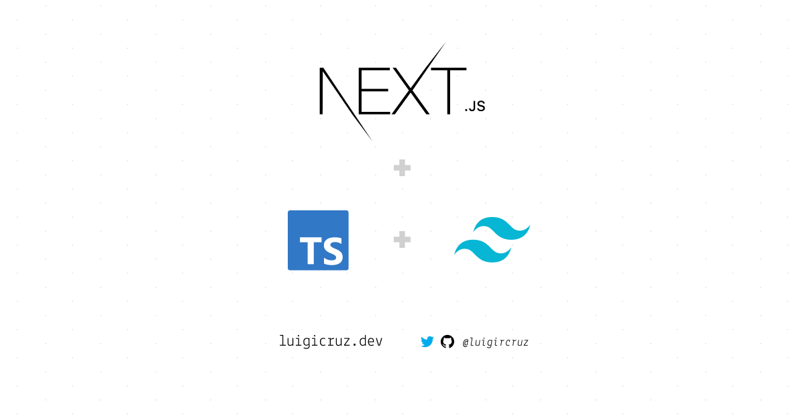

A starter preset for [NextJS](https://nextjs.org), [TypeScript](https://www.typescriptlang.org) and [TailwindCSS](https://tailwindcss.com), jumpstarting your application's development.



This preset includes [Prettier](https://prettier.io) for code formatting and the `tsconfig.json` have been configured out of the box.

## Getting Started

1. First, you'll need to clone this repo. **NOTE** that you have to replace the "`project-name`" with the name of your project.

```bash
git clone https://github.com/luigircruz/next-type-tailwind-preset.git project-name
```

2. Change directory to your project.

```bash
cd project-name
```

3. Install the project's dependencies.

```bash
npm install
# or
yarn
```

4. Run your development server:
◊
```bash
npm run dev
# or
yarn dev
```

5. Open http://localhost:3000 with your browser to see the result. 

And that's it! You now have a starter project with tailwind support in less than a minute.

## Tips

To format your codes via **Prettier**, just use the format command.

```bash
yarn format
```

To build and run your application, just use the build-start command.

```bash
yarn build-start
```

Instead of figuring out the path of your imports, just prefix your directory paths to `@/directory`.

Examples:

```js
import '@/styles/globals.css'
import MyComponent from '@/components/MyComponent'
```

You can find all of the configured paths on the [tsconfig.json](./tsconfig.json) file.